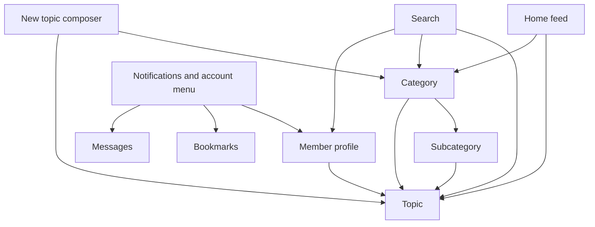

# 06 — Information architecture (draft)

Status: starting map for Phase 2 design, 2026-09-26. This translates the
decisions in [00](00-roadmap.md) into a screen map and journeys. It does not
settle the open product questions listed below.

## Product structure



The core content hierarchy stays native to Discourse:

1. **Home** is the cross-category topic feed.
2. **Category** groups topics and may contain subcategories.
3. **Subcategory** narrows a category's subject area.
4. **Topic** contains the post stream and replies.
5. **Member profile** groups a member's topics, replies and activity.

Search, notifications, bookmarks, messages and preferences are supporting
surfaces around that hierarchy. The v1 experience has no sidebar; global and
local navigation live in the header, the mobile bottom bar, and each screen's
context navigation.

## Global navigation

| Surface | Entry | Destination or action | Availability |
|---|---|---|---|
| Home | Mobile bottom bar; brand/home entry | `/latest` on the mobile bar. The bare `/` currently opens Hot; whether to align it is open below. | All visitors |
| Categories | Mobile bottom bar; native top navigation | `/categories` | All visitors |
| Search | Header search control | `/search` and native search results | All visitors |
| New Topic | Header action or mobile bottom bar | Opens the native composer when `can_create_topic` | Signed in with permission |
| Notifications | Header account menu; mobile bottom bar | Opens Discourse's notifications and account menu | Signed in |
| Profile | Account menu; mobile bottom bar | `/u/:username` | Signed in |

The bar and header actions are implemented as recorded in
[03 — Implementation](03-implementation.md). Existing site-text overrides
remain unchanged for now; the map uses Discourse's canonical content terms,
while the current UI may still display those overridden strings.

## Screen map

| Screen | Main content | Local navigation and actions | State or permission variants |
|---|---|---|---|
| Home feed | Topic cards / feed items across categories | Hot · Latest · Tracked (tracked placement is open); sort and filters | Signed out and signed in; empty or low-activity fallback |
| Categories | Category groups and subcategories | Open a category; search or browse categories | Signed out and signed in |
| Category | Category identity, description, subcategories, topics | Overview · Hot · Latest · About (planned Phase 2C) | Parent category and category with no subcategories |
| Subcategory | Subcategory identity, description and topics | Breadcrumb to parent; Overview · Hot · Latest · About (shared category grammar) | Empty and active |
| Topic | Title, category path, first post and reply stream | Reply, bookmark, watch or track, share, overflow | Signed out read state; signed in actions; closed/archived or empty reply state |
| Search | Query results across native content | All · Topics · Categories · People (planned) | Empty query, no results, populated results |
| Member profile | Identity, bio and member activity | Overview · Topics · Replies · Activity (planned) | Own profile and another member's profile |
| New Topic composer | Title, body, category and post action | Native composer controls | Permission denied, category required, draft, submitting |
| Notifications | Native notifications list | Notification type filters and account menu | Unread and empty |
| Bookmarks / Messages / Preferences | Native supporting surfaces | Native controls | Signed in; mostly native through launch |

The screen tabs above describe the target grammar, not a claim that every tab
already has a custom implementation or route. The theme should use native
Discourse routes and behavior wherever they provide the needed screen.

## Core journeys

### Read and join

```text
Visitor → Home or Categories → Topic → signup/login → return to topic → Reply
```

Visitors can read without an account. Signup should appear when a visitor
tries an account-only action, and should return them to the topic afterward.

### Find a community

```text
Home or Search → Category → Subcategory (if present) → Topic → Watch or Track
```

### Start a discussion

```text
New Topic → choose category → write title and post → Topic
```

### Return to a discussion

```text
Notification or Profile activity → Topic → Reply or continue reading
```

## Wireframe order

Start with the screens that make the launch journey work, before styling:

1. Home feed: mobile and desktop, signed out and signed in.
2. Category and subcategory: shared context header and local navigation.
3. Topic: reading, reply stream, and signed-out prompt.
4. Search results and category discovery.
5. Composer entry and post flow.
6. Profile overview and activity.

For each wireframe, show loading, empty, error, and permission states only
where they change the user's next step. Keep notifications, messages and
preferences close to native Discourse for launch.

## Decisions to settle before visual mockups

1. **Home URL:** mobile Home is `/latest`, while the bare `/` currently opens
   Hot. Decide whether the brand/home entry and the site default should also
   become `/latest`.
2. **Tracked feed:** settled 2026-09-26 — an on/off filter in the nav row, labelled with core's `user.tracked_categories` (08).
3. **Explore (settled 2026-09-30):** no separate surface for launch. The
   native Categories directory is where members browse communities; `/hot`
   and `/latest` provide the cross-category topic feeds. Members choose what
   to track and build their own feeds after signup.
4. **Category summary:** decide which native metadata is useful in the context
   header; do not add watcher counts because core does not expose them.

The topic score uses first-post likes, category watcher counts are omitted,
and replies stay in the flat topic stream per the current launch decisions in
[00](00-roadmap.md) and [05](05-phase-1-configuration.md).
