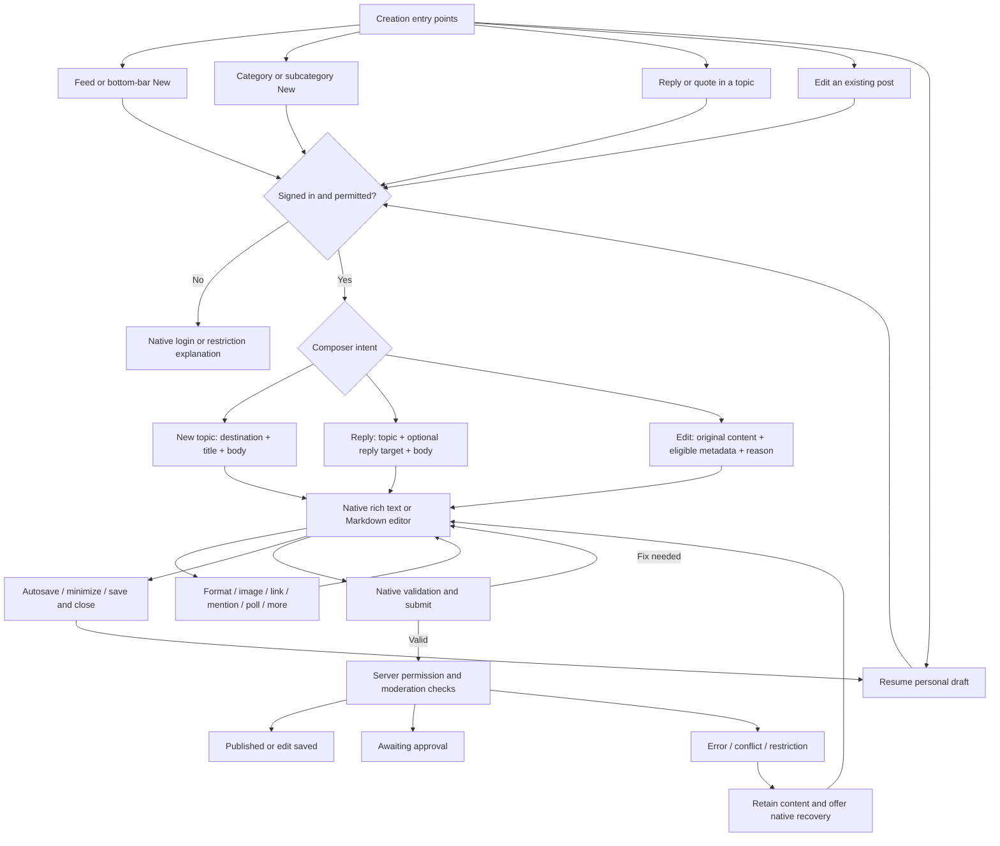
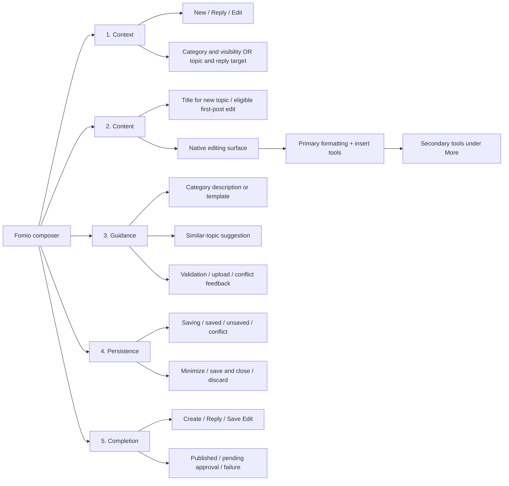
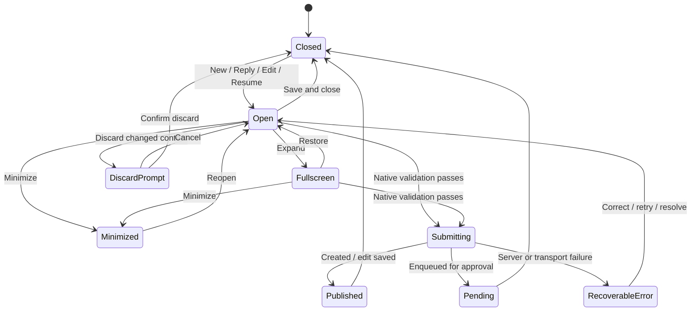
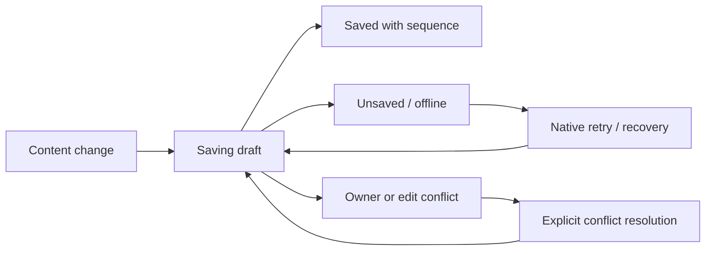
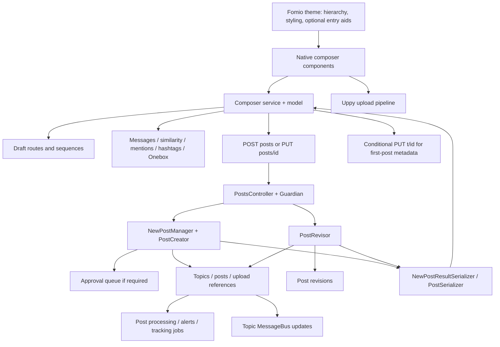

# Fomio composer — information architecture and wireframe brief

Prepared 2026-09-28. This is an IA map for later wireframes/mockups, not a finished UI or implementation commitment. Technical facts and observed/source-only distinctions are in [composer research](09-composer-research.md). Labels here describe concepts; production wording must use existing Discourse translations/site overrides.

**v4 alignment, 2026-09-30:** C01–C19 below remain the stable behavioral IDs.
The active design is now v4, and [12 — Implementation roadmap](12-composer-v4-implementation-roadmap.md)
maps these IDs plus C06/C07/C08/C10/C12/C13/C15/C16/C18/C19 subcases, TAB-1–10,
desktop and accessibility frames into delivery stages. Start with
[13 — Agent guide](13-composer-agent-guide.md). The original alternatives and
mockup-author brief below are historical; do not restart an A/B/C design
exercise or copy the mock editor into production.

### v4 additions to this IA

- Layout, intent, editor mode, keyboard/panels, draft state, per-image upload
  state and submission state are independent axes. A viewport transition
  must not reset the writing or pending work.
- Tablets have explicit portrait, landscape, 600px and 375px split-view,
  software-keyboard and hardware-keyboard states. The rules in the v4 handoff
  are targets to verify, not proof of device behavior; see roadmap D1.
- Link preview failures, attributed/multiple quotes, multi-tab draft conflict,
  permission changes, session expiry, upload partial failure, saved-edit
  return and conditional forms are first-class subcases, not just menu items.
- Native content and routes remain those in doc 09. New recovery controls,
  panels and form-switch behavior remain proposals until their roadmap gates
  pass. A design state does not create a new backend state or endpoint.
- Trace every implementation task through frame → native owner → existing
  route/contract where needed → implementation → acceptance evidence, using
  doc 13's handoff fields. D1–D10 are not resolved by this IA alignment.

## Product model

One native composer supports different intentions. New topics need a destination and title. Replies need conversation/recipient context. Edits need original content and conflict protection. Personal drafts are recoverable working state. Rich text and Markdown are editing modes, not different kinds of post.

The baseline is a focused writing surface. Image, link and poll shortcuts are optional entry aids that feed native post content. They should not force mixed-content posts into mutually exclusive content types. AI help is excluded from the baseline because it is disabled on this site.

Native sources: research E01–E08, E13, E18. The visibility of each control is conditional; do not show all intentions simultaneously in a mockup.

## Experience anatomy

This hierarchy is a proposed design arrangement. Its building blocks already exist; source-to-surface mapping follows.

| Region | Native source | Proposed Fomio treatment | Keep conditional |
|---|---|---|---|
| Intent/context | composer service/model; action menu | Quiet, unmistakable mode and destination | PM/staff/shared-draft actions only when available |
| Destination | native category chooser | Give it enough width and expose privacy cue; inherit context | Replies use topic context, not an editable destination picker |
| Title | ComposerTitle | Full readable row on phone; natural scan order after destination | Absent for ordinary replies; eligible first-post edit only |
| Body | ComposerEditor + d-editor | Largest, least interrupted region | Native form-template creation can replace freeform input |
| Tools | native toolbar + Options | Retain common tools; use native overflow for advanced tools | Poll, upload, mode-specific controls and permissions |
| Preview | core preview / rich editing surface | Desktop Markdown preview available; avoid duplicated rich-text preview | Preview visibility and form-template preview follow core |
| Guidance | ComposerMessages; category templates | Contextual and dismissible; avoid blocking preview | Similar topics are new-topic guidance; not a reply requirement |
| Draft status | native draft state | Easy to find near completion controls | Unsaved/conflict must not look saved |
| Completion | ComposerSaveButton + service | One primary action appropriate to intent | Pending approval is distinct from immediate publication |

Sources: research E02–E04, E07–E08, E16. Existing theme styling and bottom-bar interaction: E23.

## State machine that every design must preserve

This is a UX state model, not an exact enum transcription. Core enum values include `closed`, `open`, `saving`, `draft`, `fullscreen`; saving a personal draft is an overlapping status, not the same operation as submitting a post. Error and pending outcomes are service/UI branches. Source: research E02 and E07.

Draft status is an independent axis:

No invented offline synchronization guarantee: use native behavior and verify it before implementation sign-off.

## System map for implementation

TopicAPI uses TopicsController and its own permission/conflict checks. DraftAPI and Upload have independent persistence; the diagram groups only the main content save path. Sources: research E01–E20.

## Wireframe inventory

Build these as named frames, keeping native labels and dynamic values. “Evidence” describes this inspection, not whether the future design is tested.

| ID | Frame | Required content / behavior | Evidence |
|---|---|---|---|
| C01 | New topic, empty | Destination, title, body, tools, Create action, close/minimize | Live desktop and phone baseline |
| C02 | New from category | Inherited category, change destination if permitted, category guidance | Current theme source; chooser live |
| C03 | Destination chooser | Parent/subcategory hierarchy, search, descriptions, privacy cue | Live chooser |
| C04 | Writing, rich text | Rich editor, toolbar/overflow, draft status | Live toggle and content preservation |
| C05 | Writing, Markdown | Source plus optional preview; mode switch preserves content | Live |
| C06 | Insert image | Pick/paste/drop → uploading → inserted; progress/cancel/failure | Source only; upload not performed |
| C07 | Insert link | Link entry/standalone URL → preview; failed/unsupported URL fallback | Successful Onebox live; failures untested |
| C08 | Build poll / advanced tools | Native modal/menu; table, details, date, spoiler as available | Menus live; poll creation not submitted |
| C09 | Similar-topic suggestion | Suggestions with readable title/destination; dismiss and continue | Live; desktop popup obscured preview |
| C10 | Reply / quote | Topic and reply-target context; body; Reply; no new-topic title field | Reply live; quote path source |
| C11 | Edit | Original body, eligible first-post title/category, Save Edit, cancel/reason | Live open/cancel; save source only |
| C12 | Draft lifecycle | Saving, saved, close, resume, minimized, discard confirmation | Save/close/resume/discard live; minimize source |
| C13 | Validation/restriction | Local errors, server rejection, category/role limitations; preserve work | Source only |
| C14 | Upload/network failure | Explain failed operation; keep content and distinguish unsaved state | Source only |
| C15 | Concurrent edit/draft | Conflict warning + native resolution; never silently overwrite | Source/specs only |
| C16 | Submitted | Published topic/reply or saved edit; correct return destination | Source only |
| C17 | Awaiting approval | Submission received, pending moderation, native next step | Source/specs only |
| C18 | Guided category form | Template chooser/fields, validation/preview, final native post content | Source; site flag on; assignments unverified |
| C19 | Signed out / no permission | Native auth intent or explanation; no misleading active submit | Source only |

For every core frame, annotate: intent, role, editor mode, viewport, category/privacy context, draft state, allowed action and expected result. Do not show staff-only features as ordinary-member capabilities.

## Responsive rules to test

**Desktop proposal:** keep a docked context-preserving composer and native fullscreen escape hatch. Destination and title should be readable before writing. Common tools live by the editor. Draft status and submit stay easy to scan. Markdown preview can use a second column; guidance must not cover either column.

**Phone proposal:** full-screen native composer; destination and title on separate rows; compact tool overflow; persistent but unobtrusive draft state; native submit/discard/upload actions clear of the virtual keyboard and safe area. Existing Fomio bottom navigation stays hidden while composer is open. No keyboard-height claim is proven by the 390px desktop viewport test.

**Keyboard/accessibility:** native labels, switch state, focus handling, Escape/cancel, shortcuts and visible errors; avoid CSS order that contradicts DOM/tab order. Long titles, long category names, translated strings, RTL, reduced motion, dark mode and screen-reader announcements belong in acceptance testing.

## Historical design alternatives (superseded by v4 direction)

| Alternative | What changes | What stays native | Recommendation |
|---|---|---|---|
| A — Focused composer | Hierarchy, spacing, destination clarity, guidance/status placement | Entire composer/editor/draft/save pipeline | Baseline to wireframe first |
| B — Creation shortcuts | Adds optional Text / Image / Link / Poll entry aids | Same topic/post and native insertion tools | Compare against A; keep only if clearer |
| C — Guided category creation | Select categories use configured native form templates | Form validation/preview and post submission | Separate follow-up for proven use cases |

Do not combine all three by default. Do not add AI, scheduling, arbitrary visibility choices, multi-user coediting, a new attachment backend or a replacement composer engine to make a mockup look more capable.

## Historical handoff contract for the original mockup

Use this brief together with the research packet. Produce A in desktop and phone sizes, then a small B comparison if useful. Include representative recovery and approval states alongside empty/writing frames. Show real native category/translation concepts without hardcoding them into implementation. Mark any proposed custom element with its layer: configuration, theme, theme component or server plugin. Preserve new-topic/reply/edit distinctions, both editor modes, draft status and permission outcomes.

Definition of ready for implementation: each proposed element maps to a verified native component/outlet/API or has an explicitly scoped missing capability; no fabricated routes; no “Published” success state for an enqueued result; no loss of drafts or typed content; responsive and accessible behavior is specified. New composer outlet usage must be recorded in the repository allowlist when implemented, not silently assumed from this design map.
